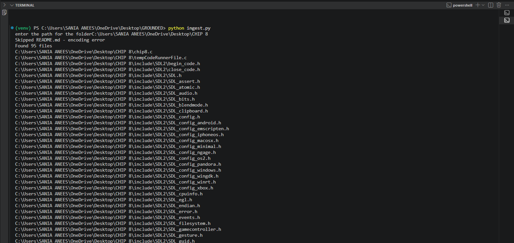
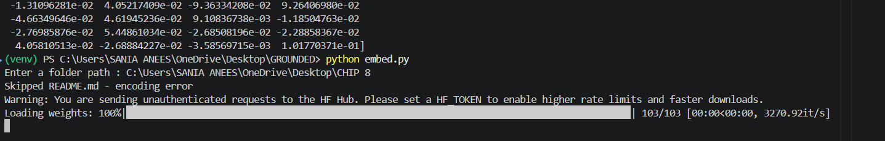
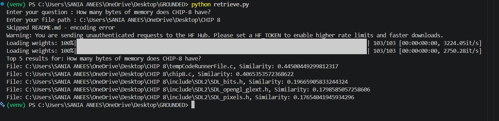
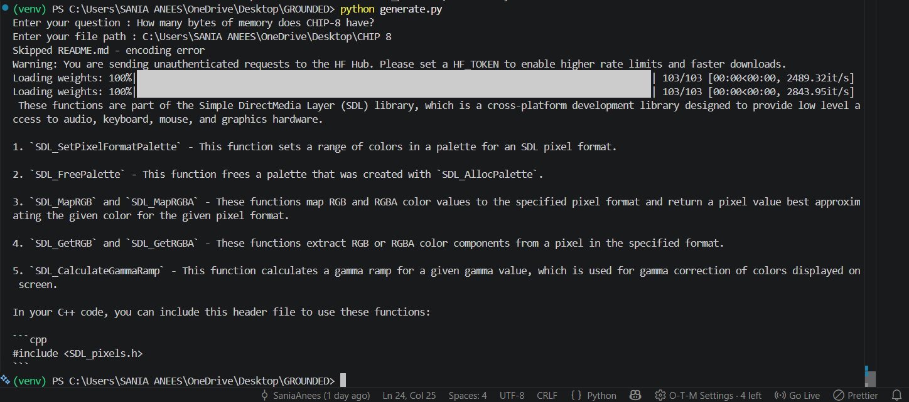
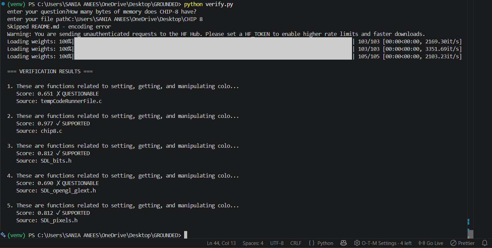
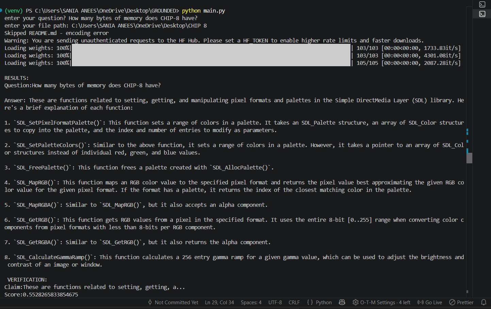

# 🔍 GROUNDED

[](https://www.python.org/)
[](LICENSE)
[](https://github.com)

## Overview

**GROUNDED** is a RAG verification system that detects LLM hallucinations using local NLI fact-checking. Instead of trusting LLM outputs blindly, GROUNDED verifies each claim against source documents with confidence scores.

## The Problem
Question: "How many bytes of memory does CHIP-8 have?"
LLM Answer: "This code defines functions related to pixel formats..." ❌
GROUNDED: "Score: 0.56 - HALLUCINATION DETECTED" ✅

## How It Works

Question → [Embed] → [Retrieve] → [Generate] → [Verify] → Confidence Scores


1. **Ingest** - Read files recursively, handle encoding errors
2. **Embed** - Convert chunks to 384-dim vectors (sentence-transformers)
3. **Retrieve** - Find similar docs using manual cosine similarity
4. **Generate** - LLM generates answer (Ollama + Mistral)
5. **Verify** - NLI model scores each claim (CrossEncoder)

## Demo Pipeline


*Complete verification workflow end-to-end*

### Stage-by-Stage Screenshots


*95 files loaded recursively from corpus*


(./assets/embed2.png)
*Vector embeddings generated from text chunks*


*Top-5 documents ranked by similarity*


*LLM generates answer from retrieved context*


*Claim-by-claim verification with confidence*


(./assets/main2.png)
(./assets/main3.png)
*Full pipeline with verification scores*

## Tech Stack

| Component | Technology | Why |
|-----------|-----------|-----|
| **Language** | Python 3.8+ | Fast iteration, rich ML ecosystem |
| **Embedding** | sentence-transformers (MiniLM-L6-v2) | 384-dim vectors, CPU-friendly |
| **LLM** | Ollama + Mistral 7B | Local inference, no API costs |
| **Verification** | CrossEncoder (RoBERTa NLI) | Natural Language Inference scoring |
| **Vector Math** | NumPy | Manual cosine similarity (transparent) |
| **File I/O** | pathlib (stdlib) | Recursive directory traversal |

### Prerequisites
- Python 3.8+
- ~8GB free disk space
- 8GB+ RAM
- Ollama: https://ollama.ai

### Setup Steps

```bash
# 1. Clone repo
git clone https://github.com/SaniaAnees/GROUNDED.git
cd GROUNDED

# 2. Create virtual environment
python -m venv venv

# Windows
.\venv\Scripts\Activate.ps1

# macOS/Linux
source venv/bin/activate

# 3. Install dependencies
pip install -r requirements.txt

# 4. Start Ollama (separate terminal)
ollama serve

# 5. Run pipeline
python main.py
```

### requirements.txt

sentence-transformers==2.2.2
ollama==0.1.25
numpy==1.24.3


### Environment Setup (.env optional)
```bash
# .env
OLLAMA_BASE_URL=http://localhost:11434
OLLAMA_MODEL=mistral
OLLAMA_NUM_GPU=0
NLI_THRESHOLD=0.7
TOP_K=5
```

## Usage

### Basic Pipeline
```bash
python main.py

# Interactive prompts:
# enter your question? How many bytes of memory does CHIP-8 have?
# enter your file path: C:\path\to\CHIP 8
```

### Component Testing
```bash
python ingest.py      # Load files (95 files)
python embed.py       # Generate embeddings
python retrieve.py    # Find similar documents
python generate.py    # Get LLM answer
python verify.py      # Verify claims with scores
```

## Performance

| Stage | Time | Notes |
|-------|------|-------|
| Ingest (95 files) | 0.5s | Disk I/O |
| Embed | 2.5s | Model loading + vectorization |
| Retrieve | 0.1s | Cosine similarity (numpy) |
| Generate | 15-20s | Ollama (Mistral on CPU) |
| Verify | 8-12s | CrossEncoder inference |
| **Total** | **26-35s** | Single query end-to-end |

## Architecture

### Ingestion
- Recursive directory traversal (`Path.rglob("*")`)
- Filter by extension (`.c`, `.h`, `.md`, `.py`, `.txt`)
- Skip unreadable files gracefully
- Output: List of `{"filename": "...", "content": "..."}`

### Embedding
- Load pre-trained `all-MiniLM-L6-v2` (384 dimensions)
- Convert each chunk: `model.encode(text)` → vector
- Attach to chunk dict

### Retrieval
- Encode question to vector
- Calculate cosine similarity: `dot(q_vec, doc_vec) / (||q_vec|| * ||doc_vec||)`
- Sort by score (1.0 = perfect match, 0.0 = no similarity)
- Return top-5 with scores

### Generation
- Concatenate retrieved documents as context
- Format prompt: `"Question: {q}\nContext: {chunks}\nAnswer:"`
- Call Ollama via HTTP: `ollama.chat(model="mistral", messages=[...])`

### Verification
- Split LLM answer into sentences (claims)
- Load `cross-encoder/qnli-distilroberta-base`
- Score each claim: `model.predict([[claim, source_doc]])[0]`
- Interpret: `>0.7 = supported`, `<0.7 = hallucination`

## Trade-offs

| Decision | Why | Trade-off |
|----------|-----|-----------|
| Manual cosine similarity | Understand retrieval math | Slower than vector DB |
| Local NLI | Cost, privacy, transparency | Slower than API |
| CPU inference | No GPU dependency | ~30s per query |
| Mistral 7B | Good quality, fits in RAM | Can't use larger models |

## Limitations

- **Semantic ≠ Factual:** NLI scores semantic similarity, not ground truth
- **Single-Pass:** No iterative retrieval if docs not in top-5
- **English-Only:** Training data is English
- **Slow:** CPU inference takes ~30 seconds
- **Domain-Specific Tuning Required:** Works best on specific domains

## Project Structure

GROUNDED/
├── ingest.py # File ingestion
├── embed.py # Vectorization
├── retrieve.py # Similarity search
├── generate.py # LLM integration
├── verify.py # NLI verification
├── main.py # Orchestration
├── requirements.txt # Dependencies
├── .env.example # Environment template
├── README.md # This file
└── assets/ # Screenshots
    ├── main.png
    ├── embed1.png
    ├── embed2.png
    ├── generate.png
    ├── ingest.png
    ├── main1.png
    ├── main2.png
    ├── main3.png
    ├── retrieve.png
    └── verify.png


## Next Steps (V2)

- [ ] Model quantization (3x speedup)
- [ ] Batch processing
- [ ] Vector DB integration (Milvus/Qdrant)
- [ ] Fine-tuned NLI on domain-specific data
- [ ] REST API (FastAPI)
- [ ] Web UI (React)


## License

MIT License - see LICENSE file

---

**Author:** Sania Anees  
**Status:** Active Development  
**Last Updated:** August 3, 2026